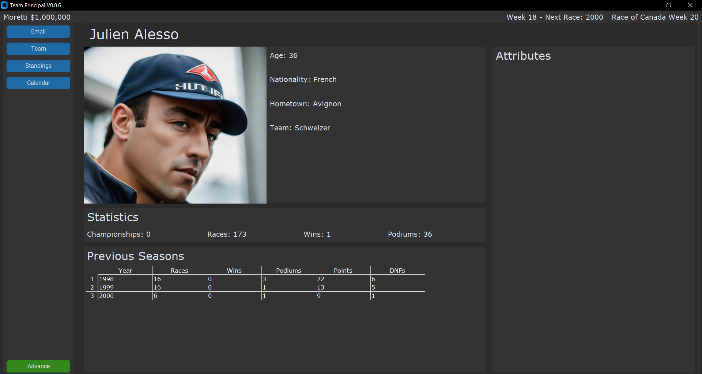

# Team Principal

An attempt to build an motorsport manager style game with python. There is no gameplay at the moment. Currently working on building screens for the UI (previews below) and fleshing out the database. The UI is built using custom tkinter.

Will add more detail to this readme later.

## Current Features

A summary of current features is provided below;

- 16 race season. The game advances 1 week at a time.
- Random race result generated
- Points (both driver and teams) are updated accordingly
- Driver statistics are udpated after each race and can be view on the driver page
- After week 52 a new season is setup
- Drivers retire
- New drivers are made available at the start of each season
- Very basic email system

## Preview

